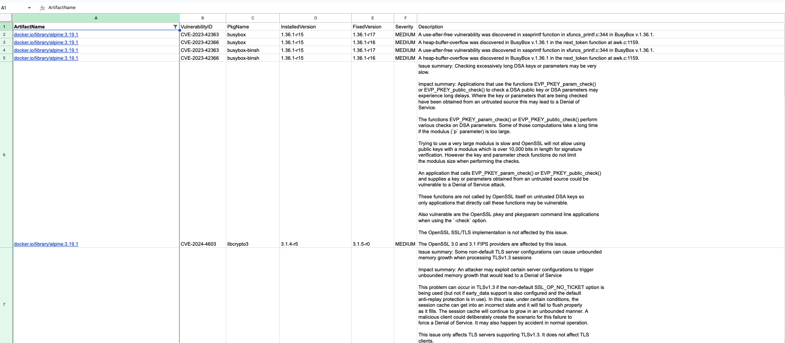

# UDS Security Hub - Scan Package

[](https://github.com/defenseunicorns/uds-security-hub/actions/workflows/build.yaml)
[](https://github.com/defenseunicorns/uds-security-hub/actions/workflows/test.yaml)
[](https://github.com/defenseunicorns/uds-security-hub/actions/workflows/lint.yaml)


[](https://goreportcard.com/report/github.com/defenseunicorns/uds-security-hub)
[](https://codecov.io/gh/defenseunicorns/uds-security-hub)
[](https://scorecard.dev/viewer/?uri=github.com/defenseunicorns/uds-security-hub)
[](https://pkg.go.dev/github.com/defenseunicorns/uds-security-hub)
[](https://slsa.dev)

_UDS Security Hub is ALPHA and expect things to change._

_UDS Security Hub depends on [trivy](https://github.com/aquasecurity/trivy) for vulnerability scanning and trivy has to be installed on the host._

## Table of Contents
- [Overview](#overview)
- [Usage](#usage)
- [Command Line Interface](#command-line-interface)
- [SLSA Verification](#slsa-verification)
- [Contributing](CONTRIBUTING.MD)

## Overview
The UDS Security Hub is a tool designed to manage and scan `zarf` packages for vulnerabilities. It leverages the Trivy vulnerability scanner to analyze container images and extract security information, facilitating the generation of CSV reports detailing identified vulnerabilities.

## Usage


### Command Line Interface
To run the scanner via the command line and generate a CSV output, use the `scan` command with the necessary flags:

```bash
scan -o [organization] -n [package-name] -g [tag] -u [docker-username] -p [docker-password] -f [output-file] -r [registry-creds] -p [package-path] -o [offline-db-path]
```

- `-o, --org`: Organization
- `-n, --package-name`: Package Name
- `-g, --tag`: Tag
- `-r, --registry-creds`: (Optional) Registry credentials in the format 'registry:username:password'. Example: 'ghcr.io:user:password'
- `-f, --output-file`: Output file for CSV results
- `-p, --package-path`: Path to the zarf package. This is for local scanning and not fetching from a remote registry.
- `-o, --offline-db-path`: Path to the offline DB to use for the scan. This should have all the files extracted from the trivy-db image and ran once before running the scan.

**Example Command for Remote Scanning:**
```bash
scan -o defenseunicorns -n packages/uds/gitlab-runner -g 16.10.0-uds.0-upstream -r ghcr.io:user:password -r registry1.dso.mil:user:password -r docker.io:user:password -f results.csv
```
**Example Command for Local Scanning**
```bash
scan -p ./pkg/scan/testdata/zarf-package-mattermost-arm64-9.9.1-uds.0.tar.zst -f results.csv
```


### Running the Scanner using the Makefile

To effectively run the scanner using the Makefile, follow these improved and detailed steps:

1. **Open Your Terminal**: Access your command line interface. This could be Terminal on macOS, Command Prompt or PowerShell on Windows, or any terminal emulator on Linux.

2. **Navigate to the Project's Directory**: Change to the directory containing the project's source code. You can do this with the `cd` command:
   ```bash
   cd path/to/uds-security-hub
   ```

3. **Build the Scanner**: Compile the project to create an executable. This is done using the `build` target in the Makefile:
   ```bash
   make build
   ```
   This command will compile the code and generate an executable in the `bin/` directory.

4. **Run the Scanner**: Execute the scanner with the necessary parameters. Assuming the executable is named `uds-security-hub`, you would run:
   ```bash
   ./bin/uds-security-hub scan -o [organization] -n [package-name] -g [tag] -u [docker-username] -p [docker-password] -f [output-file]
   ```
   Replace the placeholders (e.g., `[organization]`, `[package-name]`) with actual values relevant to your scan.

5. **Verify the Output**: After executing the command, check the specified output file or directory for the CSV file containing the scan results. Ensure that the specified output file (e.g., `results.csv`) has been created and contains the expected data.
These steps provide a clear and concise method to build and run the scanner using the Makefile, ensuring you are working with the most recent version of your tool.

## SLSA Verification

The UDS Security Hub provides SLSA (Supply Chain Levels for Software Artifacts) provenance verification for its artifacts. This verification process ensures that the artifacts have been built and signed by trusted sources, providing a level of trust and security for the users.


### Installing `slsa-verifier`

To verify the SLSA provenance of your artifacts, you need to install the `slsa-verifier`. Follow these steps to install it https://github.com/slsa-framework/slsa-verifier?tab=readme-ov-file#installation

### Verifying SLSA Provenance

Once you have installed the `slsa-verifier`, you can verify the SLSA provenance of your artifacts using the following steps:

1. **Download the Binary and Attestation**:
   - Go to the [release page](https://github.com/defenseunicorns/uds-security-hub/releases).
   - Download the `uds-security-hub_linux_amd64` binary.
   - Download the `multiple.intoto.jsonl` attestation file.

2. **Run the Verification Command**:
   Example: The release tag is `v0.0.7` and the binary is `uds-security-hub_linux_amd64`. Please replace these values with the actual release tag and binary name.
   ```bash
   slsa-verifier verify-artifact uds-security-hub_linux_amd64 \
     --provenance-path multiple.intoto.jsonl \
     --source-uri github.com/defenseunicorns/uds-security-hub \
     --source-tag v0.0.7
   ```
   This command verifies the `uds-security-hub_linux_amd64` artifact using the `multiple.intoto.jsonl` provenance file, with the source URI and tag specified.

## Contributing
If you encounter any issues or have suggestions for improvements, please feel free to open an issue or submit a pull request on the project's repository.

### Offline DB Directory Structure

The directory for the offline DB should be structured as follows:

```plaintext
/var/folders/pf/bq3t19j505xg4pprmb3ls7r0000gn/T/trivy-db-2535363142/db
├── db
│   ├── metadata.json
│   ├── trivy.db
│   └── fanal.db
```

For more details, refer to [Issue #123](https://github.com/defenseunicorns/uds-security-hub/issues/123) and [Trivy Issue #486](https://github.com/aquasecurity/trivy/issues/486).