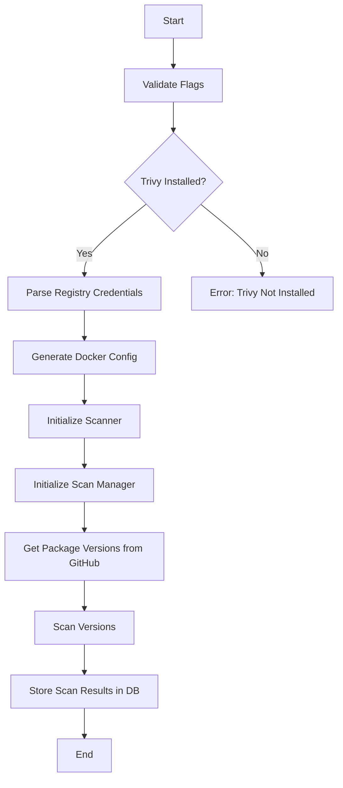

# Store Command

The `store` command is a tool designed to scan a Zarf package for vulnerabilities and store the results in a database. This command leverages various internal and external packages to perform its operations, including scanning, database interactions, and logging.

## Table of Contents

- [Overview](#overview)
- [Setup](#setup)
- [Usage](#usage)
- [Configuration](#configuration)
- [Development](#development)
- [Diagram](#diagram)

## Overview

The `store` command performs the following steps:
1. Validates required flags and checks if Trivy is installed.
2. Parses registry credentials.
3. Generates and writes Docker configuration.
4. Initializes the scanner and scan manager.
5. Retrieves package versions from GitHub.
6. Scans the specified number of versions.
7. Stores the scan results in the database.

## Setup

### Prerequisites

- Go 1.22 or later
- PostgreSQL database
- Trivy installed and available in the system PATH

## Usage

To use the `store` command, run the following:

```sh
./store store \
    --org <organization> \
    --package-name <package-name> \
    --db-host <db-host> \
    --db-user <db-user> \
    --db-password <db-password> \
    --db-name <db-name> \
    --db-port <db-port> \
    --github-token <github-token> \
    --number-of-versions-to-scan <number-of-versions> \
    --registry-creds <registry-credentials>
```

### Example

```sh
./store store \
    --org defenseunicorns \
    --package-name packages/uds/gitlab-runner \
    --db-host localhost \
    --db-user test_user \
    --db-password test_password \
    --db-name test_db \
    --db-port 5432 \
    --github-token <your-github-token> \
    --number-of-versions-to-scan 2 \
    --registry-creds "ghcr.io,user1,pass1" \
    --registry-creds "registry1.dso.mil,user2,pass2"
```

## Configuration

The `store` command accepts the following flags:

- `--org` (string): Organization name (default: "defenseunicorns")
- `--package-name` (string): Package name (e.g., "packages/uds/gitlab-runner")
- `--db-host` (string): Database host (default: "localhost")
- `--db-user` (string): Database user (default: "test_user")
- `--db-password` (string): Database password (default: "test_password")
- `--db-name` (string): Database name (default: "test_db")
- `--db-port` (string): Database port (default: "5432")
- `--github-token` (string): GitHub token for fetching package versions.
- `--number-of-versions-to-scan` (int): Number of versions to scan (default: 1)
- `--registry-creds` (stringSlice): List of registry credentials in the format 'registryURL,username,password'
- `--instance-connection-name` (string): Cloud SQL instance connection name
- `--offline-db-path` (string): Path to the offline DB to use for the scan. This should have all the files extracted from the trivy-db image and ran once before running the scan.

### Offline DB Directory Structure

The directory for the offline DB should be structured as follows:

```plaintext
/var/folders/pf/bq3t19j505xg4pprmb35ls7r0000gn/T/trivy-db-2535363142/db
├── db
│   ├── metadata.json
│   └── trivy.db
├── fanal
│   └── fanal.db
```

For more details, refer to [Issue #123](https://github.com/defenseunicorns/uds-security-hub/issues/123) and [Trivy Issue #486](https://github.com/aquasecurity/trivy/issues/486).
## Development

### Running Tests

To run the tests, use the following command:

```sh
make test-integration
```

## Diagram

Below is a diagram illustrating the flow of the `store` command:

